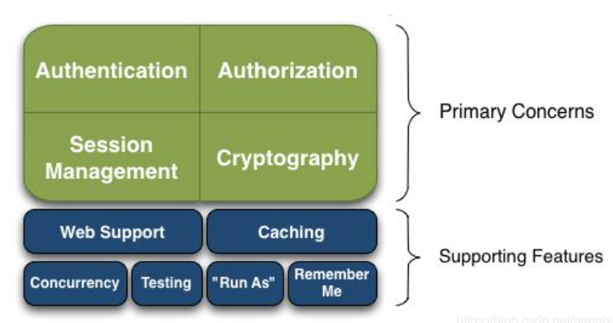

# 1.Shiro-介绍

## 1.1 Shiro简介

- Apache Shiro是一个强大且易用的Java安全框架,执行身份验证、授权、密码和会话管理
- 对比 SpringSecurity，可能没有 Spring Security 做的功能强大，但是在实际工作时 可能并不需要那么复杂的东西，所以使用小而简单的Shiro 就足够了。
- 不仅可以在JavaSE开发中使用， 也可以在JavaEE开发中使用·

官网：http://shiro.apache.org/


## 1.2 功能



- **Authentication**：身份认证/登录，验证用户是不是拥有相应的身份；
- **Authorization**：授权，即权限验证，验证某个已认证的用户是否拥有某个权限；即判断用户是否能做事情，常见的如：验证某个用户是否拥有某个角色。或者细粒度的验证某个用户对某个资源是否具有某个权限；
- **Session Manager**：会话管理，即用户登录后就是一次会话，在没有退出之前，它的所有信息都在会话中；会话可以是普通 JavaSE 环境的，也可以是如 Web 环境的；
- **Cryptography**：加密，保护数据的安全性，如密码加密存储到数据库，而不是明文存储；
- **Web Support**：Web 支持，可以非常容易的集成到 Web 环境；
- **Caching**：缓存，比如用户登录后，其用户信息、拥有的角色/权限不必每次去查，这样可以提高效率；
- **Concurrency**：shiro 支持多线程应用的并发验证，即如在一个线程中开启另一个线程，能把权限自动传播过去；
- **Testing**：提供测试支持；
- **Run As**：允许一个用户假装为另一个用户（如果他们允许）的身份进行访问；
- **Remember Me**：记住我，这个是非常常见的功能，即一次登录后，下次再来的话不用登录记住一点，Shiro 不会去维护用户、维护权限；这些需要我们自己去设计/提供；然后通过相应的接口注入给 Shiro 即可。

## 1.3构架（内部）


- **Subject**：主体，可以看到主体可以是任何可以与应用交互的“用户”；
- **SecurityManager** ： 安全管理器，相 当 于 SpringMVC 中 的 DispatcherServlet 或 者 Struts2 中的
	**FilterDispatcher**；是 Shiro 的心脏；所有具体的交互都通过 SecurityManager 进行控制；它管理着所有 Subject、且负责进行认证和授权、及会话、缓存的管理。Subject的认证和授权都要在安全管理器下进行
- **Authenticator**：认证器，负责主体认证的，这是一个扩展点，如果用户觉得 Shiro 默认的不好，可以自定义实现；其需要认证策略（Authentication Strategy），即什么情况下算用户认证通过了；
- **Authrizer**：授权器，或者访问控制器，用来决定主体是否有权限进行相应的操作；即控制着用户能访问应用中的哪些功能；
- **Realm**：数据域，可以有 1 个或多个 Realm，可以认为是安全实体数据源，即用于获取安全实体的；可以是 JDBC 实现，也可以是 LDAP 实现，或者内存实现等等；由用户提供；注意：Shiro不知道你的用户/权限存储在哪及以何种格式存储；所以我们一般在应用中都需要实现自己的 Realm；
- **SessionManager**：如果写过 Servlet 就应该知道 Session 的概念，Session 呢需要有人去管理它的生命周期，这个组件就是 SessionManager；而 Shiro 并不仅仅可以用在 Web 环境，也可以用在如普通的 JavaSE 环境、EJB 等环境；所有呢，Shiro 就抽象了一个自己的 Session来管理主体与应用之间交互的数据；这样的话，比如我们在 Web 环境用，刚开始是一台Web 服务器；接着又上了台 EJB 服务器；这时想把两台服务器的会话数据放到一个地方，
	这个时候就可以实现自己的分布式会话（如把数据放到 Memcached 服务器）；
- **SessionDAO**：DAO 大家都用过，数据访问对象，用于会话的 CRUD，比如我们想把 Session保存到数据库，那么可以实现自己的 SessionDAO，通过如 JDBC 写到数据库；比如想把Session 放到 Memcached 中，可以实现自己的 Memcached SessionDAO；另外 SessionDAO中可以使用 Cache 进行缓存，以提高性能；
- **CacheManager**：缓存控制器，来管理如用户、角色、权限等的缓存的；因为这些数据基本上很少去改变，放到缓存中后可以提高访问的性能
- **Cryptography**：密码模块，Shiro 提高了一些常见的加密组件用于如密码加密


## 1.4Shiro架构（外部）


**也就是说对于我们而言，最简单的一个 Shiro 应用：**
	应用代码通过 Subject 来进行认证和授权，而 Subject 又委托给 SecurityManager； 我们需要给 Shiro 的 SecurityManager 注入 Realm，从而让 SecurityManager 能得到合法
的用户及其权限进行判断。

## 1.5Shiro的三大核心对象

- Subject：用户
- SecurityManager：管理用户
- Realm：连接数据


##  Shiro的四大核心模块

- 身份认证：Authentication
	- 一般就是登录
- 授权：Authorization
	- 给用户分配角色或访问某些资源的权限
- 会话管理：Session Management
	- 用户的会话管理员，多数情况下是web session
- 加密：Cryptography
	- 数据加密解密，比如密码加密等


## 什么是ALC和RBAC

- **ALC：Access Control List，访问控制表**
	- 以前盛行的一助攻权限设计，它的核心在于用户直接与权限挂钩
	- 访问控制列表(ACL)是一种基于包过滤的[访问控制技术](https://baike.baidu.com/item/访问控制技术/5652430)，它可以根据设定的条件对接口上的数据包进行过滤，允许其通过或丢弃。访问控制列表被广泛地应用于[路由器](https://baike.baidu.com/item/路由器/108294)和三层[交换机](https://baike.baidu.com/item/交换机/103532)，借助于访问控制列表，可以有效地控制用户对网络的访问，从而最大程度地保障网络安全。
	- 优点：简单易用，开发便捷
	- 缺点：用户直接与权限挂钩，导致在授权时的复杂性比较分散，不便于管理
- **RBAC：Role Based Access Contorl**
	- 基于角色的访问控制系统，权限与角色相关联，用户通过称为适当的角色的成员而得到这些角色的权限
	- **其基本思想是**：对系统操作的各种权限不是直接授予具体的用户，而是在用户集合与权限集合之间建立一个角色集合。每一种角色对应一组相应的权限。一旦用户被分配了适当的角色后，该用户就拥有此角色的所有操作权限。
	- **优点**：这样做的好处是，不必在每次创建用户时都进行分配权限的操作，只要分配用户相应的角色即可，而且角色的权限变更比用户的权限变更要少得多，这样将简化用户的权限管理，减少系统的开销。

# 2.Shiro-快速开始

首先创建一个干净的maven项目写练习demo

## 2.1 导入依赖

**学习从官方文档开始**

首先官方给出了一个quick start，创建HelloShiro模块，去官方的github上查看quickstart 模块中的pom.xml文件，并其中的依赖导入到自己的Hello-Shiro中。

````xml
<!--官方的github-quickstart中的以来都没有版本号，需要自己去maven中查找找自己需要的版本并导入-->

 <dependency>
        <groupId>org.apache.shiro</groupId>
        <artifactId>shiro-core</artifactId>
        <version>1.5.2</version>
    </dependency>

    <!-- configure logging -->
    <dependency>
        <groupId>org.slf4j</groupId>
        <artifactId>jcl-over-slf4j</artifactId>
        <version>1.7.30</version>
    </dependency>
    <dependency>
        <groupId>org.slf4j</groupId>
        <artifactId>slf4j-log4j12</artifactId>
        <version>1.7.30</version>
    </dependency>

    <dependency>
        <groupId>org.apache.logging.log4j</groupId>
        <artifactId>log4j-core</artifactId>
        <version>2.13.1</version>
    </dependency>
````

## 2.2 log4j.properties

再次查看github中quickstart中给出配置文件，项目中给出了两个配置文件一个是log4j的，一个是shiro.ini

首先查看log4j的配置文件，并在我们项目中创建相同的配置文件log4j.properties

```properties
log4j.rootLogger=INFO, stdout

log4j.appender.stdout=org.apache.log4j.ConsoleAppender
log4j.appender.stdout.layout=org.apache.log4j.PatternLayout
log4j.appender.stdout.layout.ConversionPattern=%d %p [%c] - %m %n

# General Apache libraries
log4j.logger.org.apache=WARN

# Spring
log4j.logger.org.springframework=WARN

# Default Shiro logging
log4j.logger.org.apache.shiro=INFO

# Disable verbose logging
log4j.logger.org.apache.shiro.util.ThreadContext=WARN
log4j.logger.org.apache.shiro.cache.ehcache.EhCache=WARN
```

## 2.3 shiro.ini

然后创建相同的shiro.ini

```ini
[users]
# user 'root' with password 'secret' and the 'admin' role
root = secret, admin
# user 'guest' with the password 'guest' and the 'guest' role
guest = guest, guest
# user 'presidentskroob' with password '12345' ("That's the same combination on
# my luggage!!!" ;)), and role 'president'
presidentskroob = 12345, president
# user 'darkhelmet' with password 'ludicrousspeed' and roles 'darklord' and 'schwartz'
darkhelmet = ludicrousspeed, darklord, schwartz
# user 'lonestarr' with password 'vespa' and roles 'goodguy' and 'schwartz'
lonestarr = vespa, goodguy, schwartz

# -----------------------------------------------------------------------------
# Roles with assigned permissions
#
# Each line conforms to the format defined in the
# org.apache.shiro.realm.text.TextConfigurationRealm#setRoleDefinitions JavaDoc
# -----------------------------------------------------------------------------
[roles]
# 'admin' role has all permissions, indicated by the wildcard '*'
admin = *
# The 'schwartz' role can do anything (*) with any lightsaber:
schwartz = lightsaber:*
# The 'goodguy' role is allowed to 'drive' (action) the winnebago (type) with
# license plate 'eagle5' (instance specific id)
goodguy = winnebago:drive:eagle5
```

## 2.4 Quickstart 

导入官方写好的Quickstart ：

```java
import org.apache.shiro.SecurityUtils;
import org.apache.shiro.authc.*;
import org.apache.shiro.config.IniSecurityManagerFactory;
import org.apache.shiro.mgt.SecurityManager;
import org.apache.shiro.session.Session;
import org.apache.shiro.subject.Subject;
import org.apache.shiro.util.Factory;
import org.slf4j.Logger;
import org.slf4j.LoggerFactory;


/**
 * Simple Quickstart application showing how to use Shiro's API.
 *
 * @since 0.9 RC2
 */
public class Quickstart {

    private static final transient Logger log = LoggerFactory.getLogger(Quickstart.class);


    public static void main(String[] args) {

        // The easiest way to create a Shiro SecurityManager with configured
        // realms, users, roles and permissions is to use the simple INI config.
        // We'll do that by using a factory that can ingest a .ini file and
        // return a SecurityManager instance:

        // Use the shiro.ini file at the root of the classpath
        // (file: and url: prefixes load from files and urls respectively):
        Factory<SecurityManager> factory = new IniSecurityManagerFactory("classpath:shiro.ini");
        SecurityManager securityManager = factory.getInstance();

        // for this simple example quickstart, make the SecurityManager
        // accessible as a JVM singleton.  Most applications wouldn't do this
        // and instead rely on their container configuration or web.xml for
        // webapps.  That is outside the scope of this simple quickstart, so
        // we'll just do the bare minimum so you can continue to get a feel
        // for things.
        SecurityUtils.setSecurityManager(securityManager);

        // Now that a simple Shiro environment is set up, let's see what you can do:

        // get the currently executing user:
        Subject currentUser = SecurityUtils.getSubject();

        // Do some stuff with a Session (no need for a web or EJB container!!!)
        Session session = currentUser.getSession();
        session.setAttribute("someKey", "aValue");
        String value = (String) session.getAttribute("someKey");
        if (value.equals("aValue")) {
            log.info("Retrieved the correct value! [" + value + "]");
        }

        // let's login the current user so we can check against roles and permissions:
        if (!currentUser.isAuthenticated()) {
            UsernamePasswordToken token = new UsernamePasswordToken("lonestarr", "vespa");
            token.setRememberMe(true);
            try {
                currentUser.login(token);
            } catch (UnknownAccountException uae) {
                log.info("There is no user with username of " + token.getPrincipal());
            } catch (IncorrectCredentialsException ice) {
                log.info("Password for account " + token.getPrincipal() + " was incorrect!");
            } catch (LockedAccountException lae) {
                log.info("The account for username " + token.getPrincipal() + " is locked.  " +
                        "Please contact your administrator to unlock it.");
            }
            // ... catch more exceptions here (maybe custom ones specific to your application?
            catch (AuthenticationException ae) {
                //unexpected condition?  error?
            }
        }

        //say who they are:
        //print their identifying principal (in this case, a username):
        log.info("User [" + currentUser.getPrincipal() + "] logged in successfully.");

        //test a role:
        if (currentUser.hasRole("schwartz")) {
            log.info("May the Schwartz be with you!");
        } else {
            log.info("Hello, mere mortal.");
        }

        //test a typed permission (not instance-level)
        if (currentUser.isPermitted("lightsaber:wield")) {
            log.info("You may use a lightsaber ring.  Use it wisely.");
        } else {
            log.info("Sorry, lightsaber rings are for schwartz masters only.");
        }

        //a (very powerful) Instance Level permission:
        if (currentUser.isPermitted("winnebago:drive:eagle5")) {
            log.info("You are permitted to 'drive' the winnebago with license plate (id) 'eagle5'.  " +
                    "Here are the keys - have fun!");
        } else {
            log.info("Sorry, you aren't allowed to drive the 'eagle5' winnebago!");
        }

        //all done - log out!
        currentUser.logout();

        System.exit(0);
    }
}
```

## 2.5运行

运行quickstart，只是打印了一些日志信息

````tex
2020-04-18 13:39:30,549 INFO [org.apache.shiro.session.mgt.AbstractValidatingSessionManager] - Enabling session validation scheduler... 
2020-04-18 13:39:32,040 INFO [Quickstart] - Retrieved the correct value! [aValue] 
2020-04-18 13:39:32,044 INFO [Quickstart] - User [lonestarr] logged in successfully. 
2020-04-18 13:39:32,044 INFO [Quickstart] - May the Schwartz be with you! 
2020-04-18 13:39:32,045 INFO [Quickstart] - You may use a lightsaber ring.  Use it wisely. 
2020-04-18 13:39:32,046 INFO [Quickstart] - You are permitted to 'drive' the winnebago with license plate (id) 'eagle5'.  Here are the keys - have fun! 

Process finished with exit code 0
````

# 3.QuickStart源码分析

官方给出的Quickstart，其中前三行代码是死的：

````java
Factory<SecurityManager> factory = new IniSecurityManagerFactory("classpath:shiro.ini");
SecurityManager securityManager = factory.getInstance();
SecurityUtils.setSecurityManager(securityManager);
````

真正有用的从第三行开始：

```java
// get the currently executing user:获取当前的用户对象 subject
Subject currentUser = SecurityUtils.getSubject();

// Do some stuff with a Session (no need for a web or EJB container!!!)，通过当前用户拿到session
Session session = currentUser.getSession();
//给session对象设置了值
session.setAttribute("someKey", "aValue");
String value = (String) session.getAttribute("someKey");
if (value.equals("aValue")) {
    log.info("Retrieved the correct value! [" + value + "]");
}

// let's login the current user so we can check against roles and permissions:
//判断当前用户是否被认证
if (!currentUser.isAuthenticated()) {
    //Token（令牌） ，通过用户的username和password这设置了一个令牌
    UsernamePasswordToken token = new UsernamePasswordToken("lonestarr", "vespa");
    token.setRememberMe(true);//设置记住我

    try {
        currentUser.login(token);//执行登陆操作

    } catch (UnknownAccountException uae) {     //未知用户报错，不但钱用户的使用就会报错
        log.info("There is no user with username of " + token.getPrincipal());
    } catch (IncorrectCredentialsException ice) {       //密码错误
        log.info("Password for account " + token.getPrincipal() + " was incorrect!");
    } catch (LockedAccountException lae) {      //账户被锁定
        log.info("The account for username " + token.getPrincipal() + " is locked.  " +
                 "Please contact your administrator to unlock it.");
    }
    // ... catch more exceptions here (maybe custom ones specific to your application?
    catch (AuthenticationException ae) {
        //unexpected condition?  error?
    }
}

//say who they are: 获取当前用户的认证
//print their identifying principal (in this case, a username):
log.info("User [" + currentUser.getPrincipal() + "] logged in successfully.");

//test a role:  测试角色
if (currentUser.hasRole("schwartz")) {
    log.info("May the Schwartz be with you!");
} else {
    log.info("Hello, mere mortal.");
}

//粗粒度
//test a typed permission (not instance-level)  检测权限，权限是在shiro.ini中配置的
if (currentUser.isPermitted("lightsaber:wield")) {
    log.info("You may use a lightsaber ring.  Use it wisely.");
} else {
    log.info("Sorry, lightsaber rings are for schwartz masters only.");
}

//细粒度
//a (very powerful) Instance Level permission:
if (currentUser.isPermitted("winnebago:drive:eagle5")) {
    log.info("You are permitted to 'drive' the winnebago with license plate (id) 'eagle5'.  " +
             "Here are the keys - have fun!");
} else {
    log.info("Sorry, you aren't allowed to drive the 'eagle5' winnebago!");
}

//all done - log out! 注销
currentUser.logout();
//结束
System.exit(0);
```

# 4.Subject分析


- 首先要获取Subject对象：``Subject currentUser = SecurityUtils.getSubject();``
- 通过Subject对象获取Session对象：``Session session = currentUser.getSession();``
- 通过Subject对象判断当前用户是否被认证：``currentUser.isAuthenticated()``
- 获取当前用户的认证：``currentUser.getPrincipal()``
- 获取用户是否拥有某个角色：``currentUser.hasRole("schwartz")``
- 获取当前用户的权限：``currentUser.isPermitted("lightsaber:wield")``
- 注销：``currentUser.logout();``

我们可以通过Subject对象来完成以上操作


# 5.SpringBoot中整合Shiro

## 5.1环境搭建

### 导入依赖

- 新建SpringBoot项目

- 导入SpringBoot整合Shiro的整合包

	- ```xml
		<dependency>
		    <groupId>org.apache.shiro</groupId>
		    <artifactId>shiro-spring-boot-web-starter</artifactId>
		</dependency>
		<!--如果不确定导那个包，就去GitHub对应的包里面找
		这个包就是Shiro在GitHub上的项目中包：shiro/samples/spring-boot-web/pom.xml
		或者在Shiro的官方文档中找：http://shiro.apache.org/download.html#latestBinary
		-->
		<!--注意：
				以上两个包有可能会报错，需要去maven仓库总导入相关的包
		-->
		<dependency>
		    <groupId>org.apache.shiro</groupId>
		    <artifactId>shiro-spring-boot-web-starter</artifactId>
		    <version>1.5.2</version>
		</dependency>
		```


### 编写配置类

编写配置类需要做三大核心对象（都需要注入到Spring中）：

- ShiroFilterFactoryBean

- DefaultWebSecurityManager

- 创建 Realm对象，需要自定义类

	- 自定义Realm对象，需要做一件事继承AuthorizingRealm类并重写其中方法：

	- ```java
		@Component
		public class UserRealm extends AuthorizingRealm {
		
		    //授权
		    @Override
		    protected AuthorizationInfo doGetAuthorizationInfo(PrincipalCollection principalCollection) {
		        System.out.println("UserRealm=>授权方法被执行了");
		        return null;
		    }
		
		    //认证
		    @Override
		    protected AuthenticationInfo doGetAuthenticationInfo(AuthenticationToken authenticationToken) throws AuthenticationException {
		        System.out.println("UserRealm=>认证方法被执行了");
		        return null;
		    }
		}
		```

配置类：

```java
@Configuration
public class ShiroConfig {

    //ShiroFilterFactoryBean
    @Bean(name = "shiroFilterFactoryBean")
    public ShiroFilterFactoryBean getShiroFilterFactoryBean(@Qualifier("getDefaultWebSecurityManager") DefaultWebSecurityManager securityManager) {
        ShiroFilterFactoryBean bean = new ShiroFilterFactoryBean();

        //绑定DefaultWebSecurityManager,设置安全管理器
        bean.setSecurityManager(securityManager);

        return bean;
    }

    //DefaultWebSecurityManager
    @Bean()
    public DefaultWebSecurityManager getDefaultWebSecurityManager(@Qualifier("userRealm")UserRealm userRealm) {
        DefaultWebSecurityManager securityManager = new DefaultWebSecurityManager();
        //关联Realm
        securityManager.setRealm(userRealm);

        return securityManager;
    }
    //创建Realm对象，此对象需要自定义类并继承AuthorizingRealm
    @Bean
    public UserRealm userRealm(){
        return new UserRealm();
    }
}

```

### 测试页面和Controller

```html
<!--index-->
<h1>首页</h1>
<h2 th:text="${msg}"></h2>
<hr>
<a th:href="@{/user/add}">添加用户</a> | <a th:href="@{/user/update}">更新用户</a>

<!--除此之外还有两个功能页-->
```

````java
@RequestMapping({"/", "index"})
public String index(Model model) {
    model.addAttribute("msg","Hello Shiro");
    return "index";
}
@RequestMapping("/user/add")
public String add() {
    return "user/add";
}

@RequestMapping("/user/update")
public String update() {
    return "user/update";
}
````

基本的环境已经搭建完成，接下来就是完成各种功能了。。。

## 5.2 实现登录拦截

Shiro实现登录拦截的都是以Filter为基础的

Shiro的内置过滤器：

- anon：无需认证就可以访问
- authc：必须经过认证才可以访问
- user：必须拥有记住我功能才能用（一般不会用）
- perms：拥有对某个资源的权限才能访问
- role：拥有某个角色权限才能能访问

Shiro不像SpringSecurity一样没有权限的用户访问需要权限的资源会自动跳转到登录页面，Shiro需要自己定义登录页面。

````java
//ShiroFilterFactoryBean
@Bean(name = "shiroFilterFactoryBean")
public ShiroFilterFactoryBean getShiroFilterFactoryBean(@Qualifier("getDefaultWebSecurityManager") DefaultWebSecurityManager securityManager) {
    ShiroFilterFactoryBean bean = new ShiroFilterFactoryBean();

    //绑定DefaultWebSecurityManager,设置安全管理器
    bean.setSecurityManager(securityManager);

    //添加Shiro的内置过滤器,setFilterChainDefinitionMap()方法的参数是一个Map集合
    Map<String, String> filterMap =new LinkedHashMap<>();
    filterMap.put("/","anon");//主页所有人都可以访问
    /* filterMap.put("/user/add","authc");//经过认证给你才可以访问add和update页面
        filterMap.put("/user/update","authc");*/
    filterMap.put("/user/*","authc");

    bean.setFilterChainDefinitionMap(filterMap);

    //设置登录页面，当请请求没有权限的资源的时候，跳转到登录页面
    bean.setLoginUrl("/toLogin");

    return bean;
}
````

## 5.3实现用户认证

对于现实用户验证功能来说，需要实现登录功能的Controller和Realm类联动进行。

- 在Controller获取前端出传递的用户名和密码，然后保存到UsernamePasswordToken中
- 在Realm执行认知操作的方法中根据token获取用户信息，然后进行认证操作

**Controller：**

````java
@RequestMapping("/login")
public String login(String username, String password, Model model) {
    //获取获取当前的用户,在QuickStart类中,操作参考QuickStart
    Subject subject = SecurityUtils.getSubject();
    //封装用户的登陆数据
    UsernamePasswordToken token = new UsernamePasswordToken(username, password);
    //登录
    try {
        subject.login(token);//login()方法帮我们执行登录的方法，没有异常则就Ok
        return "index";
    } catch (UnknownAccountException uae) {
        //用户名不存在
        model.addAttribute("msg", "用户名不存在");
        return "login";
    } catch (IncorrectCredentialsException ice) {
        model.addAttribute("msg", "密码错误");
        return "login";
    }
}
````

**UserRealm.doGetAuthenticationInfo:**

````java
//认证
@Override
protected AuthenticationInfo doGetAuthenticationInfo(AuthenticationToken token) throws AuthenticationException {
    System.out.println("UserRealm=>认证方法被执行了");
    //验证用户名，密码,数据库中取
    String name = "root";
    String password = "admin";
    //只要登录就会走这个方法，并且可以从token中获取登录信息
    UsernamePasswordToken userToken = (UsernamePasswordToken) token;

    if (!userToken.getUsername().equals(name)) {
        return null;  //返回null就会抛出异常，这个异常就是我们在Controller捕获的用户名错误异常
    }

    /*
            对于密码的判断，Shiro不交给开发者来做，Shiro将自己完成，
            由AuthenticationInfo接口的实现类：SimpleAuthenticationInfo来完成
                参数：
                    Object principal：获取当前用户的认证
                    Object credentials：密码对象
                    String realmName：认证名

         */
    return new SimpleAuthenticationInfo("",password,"");
}
````


## 5.4整合MyBatis

### 环境

首先将MyBatis整合到springboot中，在配置Druid的数据源

相关的依赖：

```xml
<!-- https://mvnrepository.com/artifact/mysql/mysql-connector-java -->
<dependency>
    <groupId>mysql</groupId>
    <artifactId>mysql-connector-java</artifactId>
    <version>8.0.18</version>
</dependency>
<!-- https://mvnrepository.com/artifact/com.alibaba/druid -->
<dependency>
    <groupId>com.alibaba</groupId>
    <artifactId>druid</artifactId>
    <version>1.1.22</version>
</dependency>
<!-- https://mvnrepository.com/artifact/org.apache.logging.log4j/log4j-core -->
<dependency>
    <groupId>org.apache.logging.log4j</groupId>
    <artifactId>log4j-core</artifactId>
    <version>2.13.1</version>
</dependency>
<!-- https://mvnrepository.com/artifact/org.apache.logging.log4j/log4j-core -->
<dependency>
    <groupId>org.apache.logging.log4j</groupId>
    <artifactId>log4j-core</artifactId>
    <version>2.13.1</version>
</dependency>
<!-- https://mvnrepository.com/artifact/org.mybatis.spring.boot/mybatis-spring-boot-starter -->
<dependency>
    <groupId>org.mybatis.spring.boot</groupId>
    <artifactId>mybatis-spring-boot-starter</artifactId>
    <version>2.1.2</version>
</dependency>

```

配置文件

````yaml
server:
  port: 80

spring:
  datasource:
    url: jdbc:mysql://localhost:3306/mybatis?characterEncoding=utf8&useSSL=false&serverTimezone=UTC&rewriteBatchedStatements=true
    password: MySQLadmin
    driver-class-name: com.mysql.cj.jdbc.Driver
    username: root
    type: com.alibaba.druid.pool.DruidDataSource
    #=== 连接池配置 ===#
    initialSize: 5    # 初始化连接个数
    minIdle: 5        # 最小空闲连接个数
    maxActive: 20     # 最大连接个数
    maxWait: 60000    # 获取连接时最大等待时间，单位毫秒。
    timeBetweenEvictionRunsMillis: 60000   # 配置间隔多久才进行一次检测，检测需要关闭的空闲连接，单位是毫秒
    minEvictableIdleTimeMillis: 300000     # 配置一个连接在池中最小生存的时间，单位是毫秒
    validationQuery: SELECT 1 FROM DUAL    # 用来检测连接是否有效的sql，要求是一个查询语句。
    testWhileIdle: true       # 建议配置为true，不影响性能，并且保证安全性。如果空闲时间大于timeBetweenEvictionRunsMillis，执行validationQuery检测连接是否有效。
    testOnBorrow: false       # 申请连接时执行validationQuery检测连接是否有效，做了这个配置会降低性能
    testOnReturn: false       # 归还连接时执行validationQuery检测连接是否有效，做了这个配置会降低性能
    poolPreparedStatements: true    #是否缓存preparedStatement，也就是PSCache。PSCache对支持游标的数据库性能提升巨大，比如说oracle。在mysql下建议关闭。
    maxPoolPreparedStatementPerConnectionSize: 20     #要启用PSCache，必须配置大于0，当大于0时，poolPreparedStatements自动触发修改为true。在Druid中，不会存在Oracle下PSCache占用内存过多的问题，可以把这个数值配置大一些，比如说100
    filters: stat,wall        # 配置监控统计拦截的filters，stat:监控统计、log4j：日志记录、wall：防御sql注入
    useGlobalDataSourceStat: true   # 合并多个DruidDataSource的监控数据
    connectionProperties: druid.stat.mergeSql=true;druid.stat.slowSqlMillis=500     # 通过connectProperties属性来打开mergeSql功能；慢SQL记录

#SpringBoot整合MyBatis
mybatis:
  type-aliases-package: com.pojo
  mapper-locations: classpath:mybatis/mapper/*.xml
````

搭建：

- mapper：编写Mapper类，并配置Mapper.xml
- serivce：编写Serive调用Mapper层

### 在Shiro中整合MyBatis

其实操作非常简单：

- 只需要在Realm中整合一个Service，Service会调用Mapper查询数据库
- 在对查询到的内容进行判断就好了

```java
@Autowired
private UserServiceImpl userService;

//认证
@Override
protected AuthenticationInfo doGetAuthenticationInfo(AuthenticationToken token) throws AuthenticationException {
    UsernamePasswordToken userToken = (UsernamePasswordToken) token;

    User user = userService.queryUserByName(userToken.getUsername());
    if (user == null) {
        return null;
    }
    //可以加密，MD5 ， MD5盐值加密
    return new SimpleAuthenticationInfo("", user.getPwd(), "");
}
```

## 5.5 请求授权实现

 

## 5.6整合Thymeleaf

想要实现的效果是在页面上根据登录的不同用户权限显示不同的内容。

首先导入依赖：

```xml
<!-- https://mvnrepository.com/artifact/com.github.theborakompanioni/thymeleaf-extras-shiro -->
<dependency>
    <groupId>com.github.theborakompanioni</groupId>
    <artifactId>thymeleaf-extras-shiro</artifactId>
    <version>2.0.0</version>
</dependency>

```

整合Thymeleaf需要进行配置，核心对象：``ShiiroDialect``,需要将此对象注入到Spring中即可

```java

```

